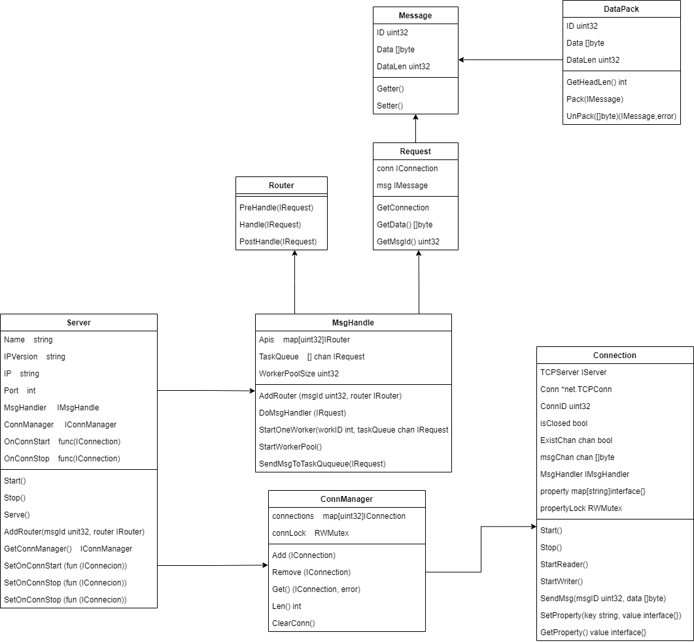

## zinx

### 1. 简单介绍

zinx是一个TCP服务器框架，包括以下功能：

- 注册路由
- TCP连接管理
- 消息封装
- 连接回调函数
- 设置连接属性

初识zinx架构：


### 2. 快速开始

克隆代码到`GOPATH`中

```shell
$ git clone https://github.com/k0k1a/zinx.git
```

#### 2.1 编写Server

使用zinx编写TCP服务器，只需要3步

```go
func main() {
	//1.创建server句柄，使用zinx
	server := znet.NewServer()

	//2.给当前服务器添加自定义路由
	server.AddRouter(0, &HelloRouter{})

	//3.启动服务
	server.Serve()
}
```

其中自定义路由方法如下：

```go
package main

import (
	"fmt"

	"github.com/k0k1a/zinx/ziface"
	"github.com/k0k1a/zinx/znet"
)

//自定义路由 继承znet包下的BaseRouter
type HelloRouter struct {
	znet.BaseRouter
}

//Handle 路由的业务逻辑方法
func (p *HelloRouter) Handle(request ziface.IRequest) {
	fmt.Println("Call HelloRouter router Handle")
	fmt.Println("recv from client:msgId=", request.GetMsgID(), "data=", string(request.GetData()))

	err := request.GetConnection().SendMsg(201, []byte("Hello Client"))
	if err != nil {
		fmt.Println(err)
	}
}
```

#### 2.2 编写Client

客户端使用TCP与服务器建立连接，消息格式为` MsgLen|MsgId|Data `

```go
package main

import (
	"fmt"
	"io"
	"net"
	"time"

	"github.com/k0k1a/zinx/znet"
)

func main() {
	fmt.Println("client0 is starting")
	time.Sleep(1 * time.Second)
	conn, err := net.Dial("tcp4", "127.0.0.1:8999")
	if err != nil {
		fmt.Println("client start err", err)
		return
	}

	for {
		//发送封包的消息,MsgID:0
		dp := znet.NewDataPack()
		binaryMsg, err := dp.Pack(znet.NewMsgPackage(0, []byte("client test msg")))
		if err != nil {
			fmt.Println("Pack error", err)
			return
		}

		if _, err := conn.Write(binaryMsg); err != nil {
			fmt.Println("write error", err)
			return
		}

		binaryHead := make([]byte, dp.GetHeadLen())
		if _, err := io.ReadFull(conn, binaryHead); err != nil {
			fmt.Println("read head error", err)
			break
		}
		msgHead, err := dp.Unpack(binaryHead)
		if err != nil {
			fmt.Println("client unpack msgHead err", err)
			break
		}

		if msgHead.GetMsgLen() > 0 {
			msg := msgHead.(*znet.Message)
			msg.Data = make([]byte, msg.GetMsgLen())

			if _, err := io.ReadFull(conn, msg.Data); err != nil {
				fmt.Println("read msg data error", err)
				return
			}

			fmt.Println("recv server msg: Id", msg.Id, "len=", msg.DataLen, "data=", string(msg.Data))
		}

		time.Sleep(1 * time.Second)
	}

}
```

### 3. 参考文档

#### 3.1 配置文件

配置信息编写在server目录下的conf/zinx.json文件中。

```json
{
    "Name":"zinx v0.10 demo Server App",
    "Host":"127.0.0.1",
    "TcpPort":8999,
    "MaxConn":3 ,
    "WorkerPoolSize":10,
    "MaxWorkerTaskLen": 1024,
}
```

`Name`:服务器应用名称

`Host`:服务器IP

`TcpPort`:服务器监听端口

`MaxConn`:允许的客户端链接最大数量

`WorkerPoolSize`:工作任务池最大工作Goroutine数量

`MaxWorkerTaskLen`:工作队列的最大长度

#### 3.2 注册路由

```go
//注册路由时，嵌入baserouter基类，然后根据需要对这个基类的方法进行重写
type BaseRouter struct {}

//路由Handle方法处理前
func (br *BaseRouter) PreHandle(request ziface.IRequest) {}

//路由逻辑
func (br *BaseRouter) Handle(request ziface.IRequest) {}

//路由Handle方法处理后
func (br *BaseRouter) PostHandle(request ziface.IRequest) {}
```

#### 3.3 注册回调函数

注册连接建立后的回调方法：

```go
server.SetOnConnStart(func(conn ziface.IConnection) {})
```

注册连接销毁前的回调方法：

```go
server.SetOnConnStop(func(conn ziface.IConnection) {})
```

#### 3.4 API

##### ziface.IRequest

1.得到当前与服务器连接对象

```go
GetConnection() IConnection
```

2.得到请求的消息数据

```go
GetData() []byte
```

3.得到当前请求消息的id

```go
GetMsgID() uint32
```

##### 连接模块

连接模块方法定义在`ziface.IConnection`中，包括以下方法：

1.获取原始的TCP连接对象

```go
GetTCPConnection() *net.TCPConn
```

2.获取远程客户端的TCP状态

```go
RemoteAddr() net.Addr
```

3.发送数据

```go
SendMsg(msgId uint32, data []byte) error
```

4.给连接添加自定义属性，可用于标识每个连接

```go
//设置连接属性
SetProperty(key string, value interface{})

//获取连接属性
GetProperty(key string) (interface{}, error)

//移除连接属性
RemoveProperty(key string)
```

### 4. 设计思想

##### 4.1 类图



##### 4.2 架构说明


工作流程：

0. 服务器启动（创建工作池Goroutine）。

1. 客户端与服务器建立TCP连接。
2. 服务器启动处理连接的Goroutine1。
3. Goroutine1创建Writer Goroutine和Reader Goroutine。
4. Reader Goroutine给具体的某一个Worker(chan)发送消息，Worker收到消息后进行处理业务逻辑。
5. Writer Goroutine等待消息通道的消息，收到消息后发送给客户端。（Router给此通道发送消息）